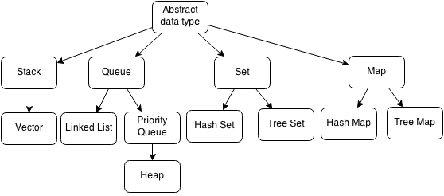

## Evaluation complexity

We consider the following complexity measures:

- Time complexity: The time complexity of an algorithm is the amount of time it takes to run as a function of the length
  of the input. The time complexity is often expressed using the Big O notation.
- Space complexity: The space complexity of an algorithm is the amount of memory it takes to run as a function of the
  length of the input. The space complexity is often expressed using the Big O notation.
- Optimal solution: The optimal solution is the solution with the least cost. The optimal solution is not always found
  by the algorithm. The algorithm may find a sub-optimal solution.
- Completeness: The algorithm found a solution if the problem has a solution.

We express the complexity measures as a function of 3 parameters:

- **b**: The branching factor of the search space. The branching factor is the number of children of a node.
- **d**: Dept minimum of a goal state in the search space. The depth of a node is the number of edges from the root node
  to the node.
- **m**: The maximum length of a path in the search space. The length of a path is the number of edges in the path.

## Pseudocode codes

To remember:



### TreeSearch Algorithm

```
TREE SEARCH(problem, strategy):
    Initialize the frontier using the initial state of problem
    Initialize the explored set to be empty
    while True
        if the frontier is empty then
            return failure
        choose a leaf node and remove it from the frontier
        if the node contains a goal state then 
            return the corresponding solution
        add the node to the explored set
        expand the chosen node, adding the resulting nodes to the frontier
        only if not in the frontier or explored set
```

Data structure for frontier should be a queue or a stack depending on the strategy.

### Monte Carlo Tree Search Algorithm

```
MCTS(problem, strategy):
    Initialize the root node with the initial state of problem
    while True
        leaf = tree policy(root)
        reward = default policy(leaf)
        backup(leaf, reward)

tree policy(root):
    node = root
    while node is not a terminal node
        if node is fully expanded
            node = best child(node, strategy)
        else
            return expand(node)
    return node

default policy(node):
    while node is not a terminal node
        node = random child(node)
    return the reward for node

backup(node, reward):
    while node is not null
        node.visits += 1
        node.reward += reward
        node = node.parent
```

### GraphSearch Algorithm

```
GRAPH SEARCH(problem, strategy):
    Initialize the frontier using the initial state of problem
    Initialize the explored set to be empty
    while True
        if the frontier is empty then
            return failure
        choose a leaf node and remove it from the frontier [depending on the strategy]
        if the node contains a goal state then 
            return the corresponding solution
        add the node to the explored set
        expand the chosen node, adding the resulting nodes to the frontier
        only if not in the frontier or explored set
```

### GraphSearch | Breath First Search

Search strategy: Choose the node that has the least depth in the frontier to expand.
We use a structure FIFO (First In First Out) to store the frontier. The frontier is a queue.

```
BFS(problem):
    Initialize the frontier using the initial state of problem
    Initialize the explored set to be empty
    if the initial state is a goal state then
        return the corresponding solution
    while True
        if the frontier is empty then
            return failure
        choose a leaf node and remove it from the frontier (the node with the least depth)
        add the node to the explored set
        for all the successors of the node do
            if the successor is not in the frontier or explored set then
                if the successor is a goal state then
                    return the corresponding solution
                add the successor to the frontier
```

Completeness: BFS is complete, which means if the shallowest goal node is at some finite depth, then BFS will find a
solution.
Because BFS expands the shallowest node first, it will find a solution at the shallowest depth.

Hypothesis: b is finite and d is finite. Algorithm is optimal because the subgraph containing all of node of breadth d
is finite.

Optimality: BFS is optimal if path cost is a non-decreasing function of the depth of the node.

Time complexity and Space complexity: $O(b^d)$ and $O(b^d)$ respectively. Where b is the branching factor and d is the depth
of the shallowest goal node.

| Depth | Nodes     | Time complexity | Space complexity |
|-------|-----------|-----------------|------------------|
| 6     | $10^6$    | 1.1s            | 1 GB             |
| 10    | $10^{10}$ | 3 hours         | 10 GB            |

### GraphSearch | Uniform Cost Search

Search strategy: Choose the node that has the least cost in the frontier to expand.
Using heap data structure to store the frontier. The frontier is a priority queue.

```
UCS(problem):
    Initialize the frontier using the initial state of problem
    Initialize the explored set to be empty
    if the initial state is a goal state then
        return the corresponding solution
    while True
        if the frontier is empty then
            return failure
        choose a leaf node and remove it from the frontier (the node with the least cost)
        add the node to the explored set
        for all the successors of the node do
            n' = result(node, action)
            score' = score(node) + cost(node, action)
            if n' is not in the frontier or explored set then
                if n' is a goal state then
                    return the corresponding solution
                add n' to the frontier with score'
            else if n' is in the frontier with score > score' then
                replace existing n' with new n' with score'
```

Hypothesis: $Cost(node, action) >= \epsilon$ for all node and action.

| Completeness | Optimality | Time complexity          | Space complexity         |
|--------------|------------|--------------------------|--------------------------|
| Yes          | Yes        | $O(b^{1+(c*/\epsilon)})$ | $O(b^{1+(c*/\epsilon)})$ |

where c* is the cost of the optimal solution and epsilon is the cost of the cheapest action.

